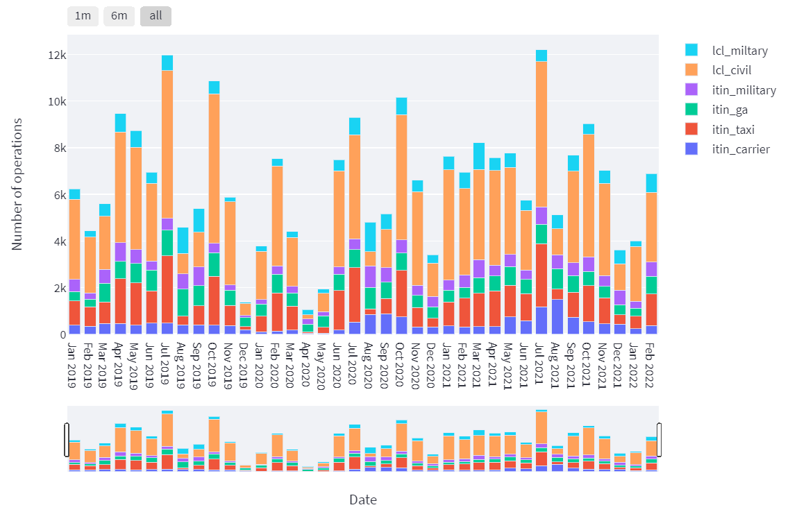

# WSDOT Electric Aviation

## About

A Python-based application utilizing Streamlit to provide structured, interactive visualizations on potential future electric aircraft operations at Paine Field and Grant County International Airport in Washington, USA.

The Python implementation is available at <https://github.com/...>. It is available under an [MIT License](LICENSE).

## Usage

The application can be found under <https://share.streamlit.io/steffen-coe/...>.

The application was written in the Python programming language (version 3.8), using the [Streamlit interface](https://streamlit.io/) to produce an interactive user interface with tables and visuals.

## Available Pages

The code for the individual pages in the Streamlit app is contained in the files the `pages/` folder.

### Start

### ✈️ Operations

This page shows the number of operations (take-offs and landings) at PAE and MWH airports.

Data is taken from the following sources:
+ [FAA's Operations Network (OPSNET)](https://aspm.faa.gov/opsnet/sys/Airport.asp), reporting counts of airport operations as recorded by the Air Traffic Activity System (ATADS)
  * Can be aggregated by day, month, or year
+ [FAA's Terminal Area Forecast (TAF)](https://taf.faa.gov/), representing official FAA forecasts of aviation activity (see also [here](https://www.faa.gov/data_research/aviation/taf))
  * Only available by year

### 💡 Electricity

This page shows the projected electricity demand (energy and power) at PAE and MWH airports.

## Licensing

See the [LICENSE](LICENSE) file for licensing information as it pertains to files in this repository.

## Requirements

Please see the [requirements](requirements.txt) for Python requirements and dependencies.

## Contact

The author can be contacted via email for any questions or help regarding the use of this app.

+ Steffen Coenen (scoenen [at] uw.edu)

## Documentation

Further documentation can be found in the code. Each function contains its own documentation with description of all function parameters.
